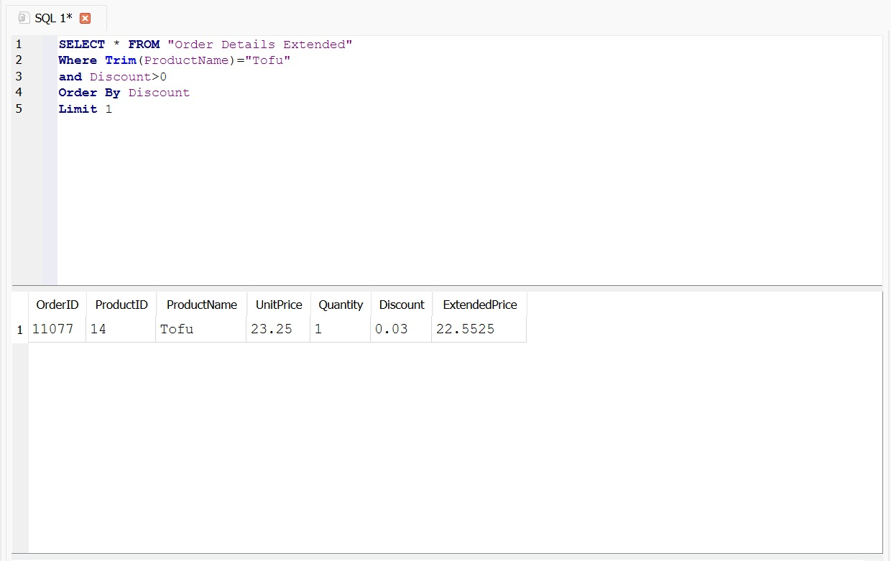
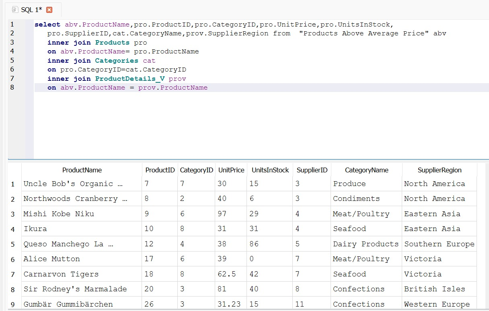
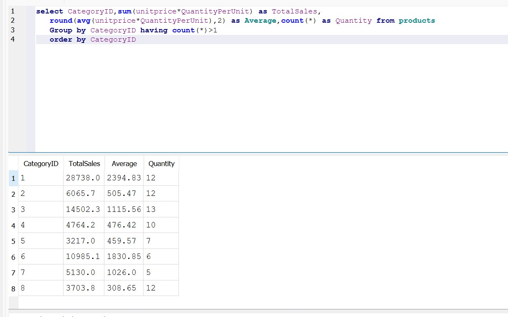
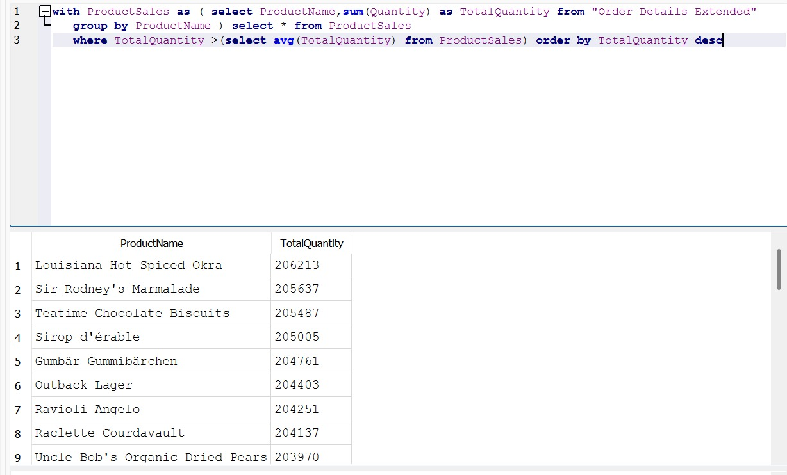
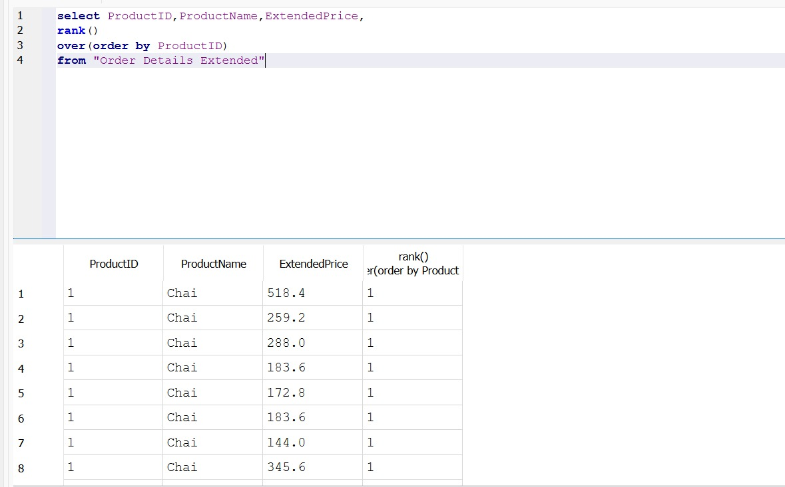
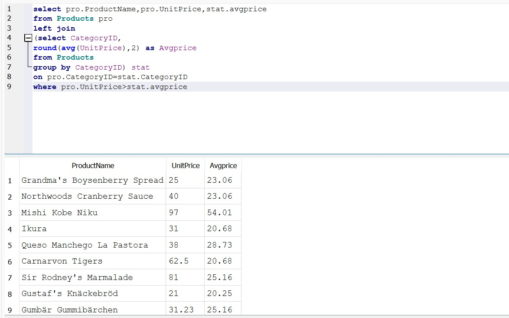

# 🔑 Week 1: SQL with SQLite

## 📌 Overview

This folder contains the work completed during Week 1 of the DevJoint Data Analytics Internship.

The main objective was to use SQLite to explore relational data, write structured SQL queries, and answer business-oriented questions using the Northwind database.

---

## 🛠️ SQL Concepts Applied

- **Data Filtering:** `SELECT`, `WHERE`, `ORDER BY`, `LIMIT`, `LIKE`, and `IS NULL`
- **Data Aggregation:** `SUM`, `AVG`, `COUNT`, `GROUP BY`, and `HAVING`
- **Table Relationships:** `INNER JOIN`, `LEFT JOIN`, and `SELF JOIN`
- **Advanced Queries:** Subqueries and Common Table Expressions (`CTE`)
- **Window Functions:** `ROW_NUMBER`, `RANK`, and cumulative calculations
- **Query Optimization:** Indexes and restructuring selected queries

---

## 🔍 Work Completed

- Explored the database tables and their relationships.
- Filtered and sorted records based on task requirements.
- Calculated totals, averages, and record counts.
- Grouped data to compare categories, customers, and products.
- Combined related tables using SQL JOIN operations.
- Used CTEs and window functions for more structured analysis.
- Added comments to explain the purpose of the main queries.

---

## 💼 Business Questions Addressed

The SQL queries were prepared to complete the following analytical tasks:

- Filter orders by product, discount, region, city, country, date, freight, and order value.
- Combine product, category, order, supplier, and employee data using `LEFT JOIN`, `INNER JOIN`, and `SELF JOIN`.
- Calculate category-level totals, averages, and product counts using `GROUP BY` and `HAVING`.
- Identify products with total quantities above the overall average using a `CTE` and a subquery.
- Rank product records and calculate cumulative quantities using window functions.
- Compare product prices with category averages and explore query optimization using an index and `JOIN`.

---

## 📂 Repository Files

| File | Description |
|---|---|
| `README.md` | Overview of the Week 1 SQL work |
| `queries.sql` | Completed SQL queries with checkpoint explanations |
| `northwind.db` | Northwind SQLite database used for the SQL queries |
| `screenshots/` | Screenshots showing the executed queries and their results |

---

## 📸 Checkpoint Evidence

The screenshots below show the executed SQL queries and their results for each Week 1 checkpoint.

<strong>Checkpoint 1 — SELECT, WHERE, ORDER BY and LIMIT</strong>

<strong>Checkpoint 2 — JOIN Operations</strong>

<strong>Checkpoint 3 — GROUP BY and HAVING</strong>

<strong>Checkpoint 4 — CTE and Subquery</strong>

<strong>Checkpoint 5 — Window Functions</strong>

<strong>Checkpoint 6 — Query Optimization</strong>

---

## 🧰 Tools Used

- SQLite
- SQL
- Northwind Database
- GitHub

---

## ✅ Status

**Week 1 completed.**

The SQL queries and supporting evidence will be available in this folder.

---

## 👤 Author

**Yalchin Hasanov**  
Junior Data Analyst
