# Week 1 — SQL with SQLite

During Week 1 of my DevJoint Data Analytics Internship, I worked with the Northwind database in SQLite.

The objective was to explore relational data, write SQL queries, and answer business questions using filtering, JOINs, aggregation, subqueries, window functions, and query optimization.

[Open the completed SQL queries](./queries.sql)

---

## Overview

In this project, I:

* Filtered and sorted product and order records
* Combined related tables using `INNER JOIN`, `LEFT JOIN`, and `SELF JOIN`
* Used ID-based relationships where the required keys were available
* Calculated sales using price, quantity, and discount data
* Grouped results by categories and customers
* Used CTEs and subqueries for multi-step analysis
* Applied window functions within product categories
* Compared query plans before and after creating an index
* Replaced a correlated subquery with a more efficient JOIN

---

## SQL Concepts Applied

* **Filtering and Sorting:** `SELECT`, `WHERE`, `BETWEEN`, `TRIM`, `ORDER BY`, and `LIMIT`
* **Aggregation:** `SUM`, `AVG`, `COUNT`, `ROUND`, `GROUP BY`, and `HAVING`
* **Table Relationships:** `INNER JOIN`, `LEFT JOIN`, and self-join
* **Advanced Queries:** CTEs, subqueries, and correlated subqueries
* **Window Functions:** `RANK`, `ROW_NUMBER`, `SUM OVER`, and `PARTITION BY`
* **Query Optimization:** `CREATE INDEX`, `DROP INDEX`, `EXPLAIN QUERY PLAN`, and query restructuring

---

## Business Questions Addressed

The SQL queries were written to complete the following analytical tasks:

* Filter orders by product, discount, location, date, freight, and calculated order value
* Combine product, category, order, supplier, and employee information
* Calculate category sales using price, quantity, and discount
* Identify the five customers with the highest total sales
* Find products whose total ordered quantity is above the overall average
* Rank products by price within their categories
* Calculate cumulative stock value for each category
* Compare query plans before and after creating an index
* Compare a correlated subquery with an optimized JOIN version

---

## Checkpoint Evidence

The sections below contain selected query results for each checkpoint.

<strong>Checkpoint 1 — SELECT, WHERE, ORDER BY and LIMIT</strong>

### Latest French orders

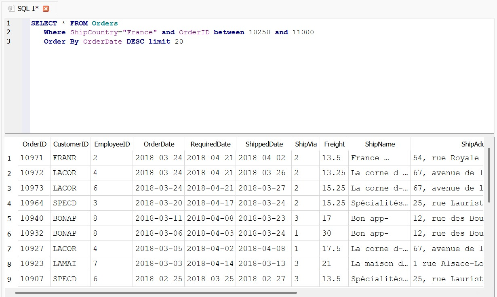

### Products with the highest calculated order value

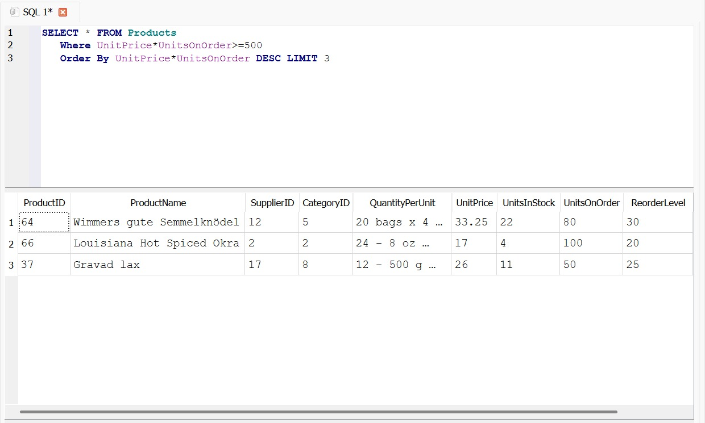

<strong>Checkpoint 2 — JOIN Operations</strong>

### LEFT JOIN

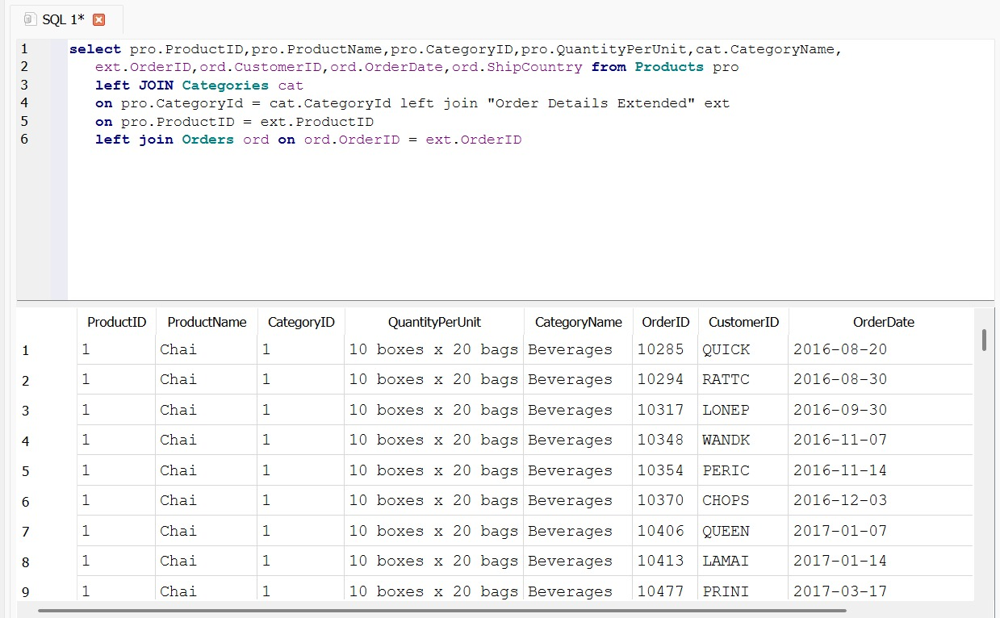

### INNER JOIN

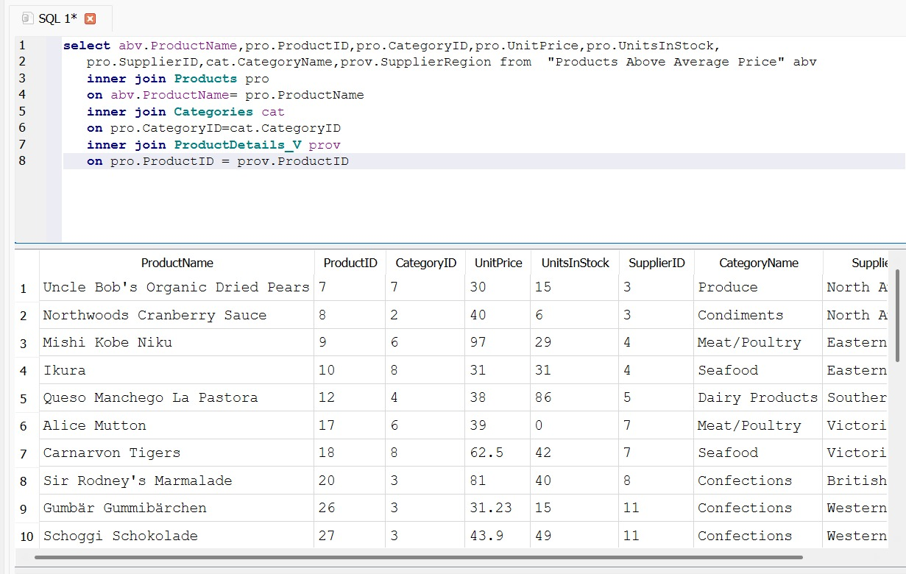

### Self-join

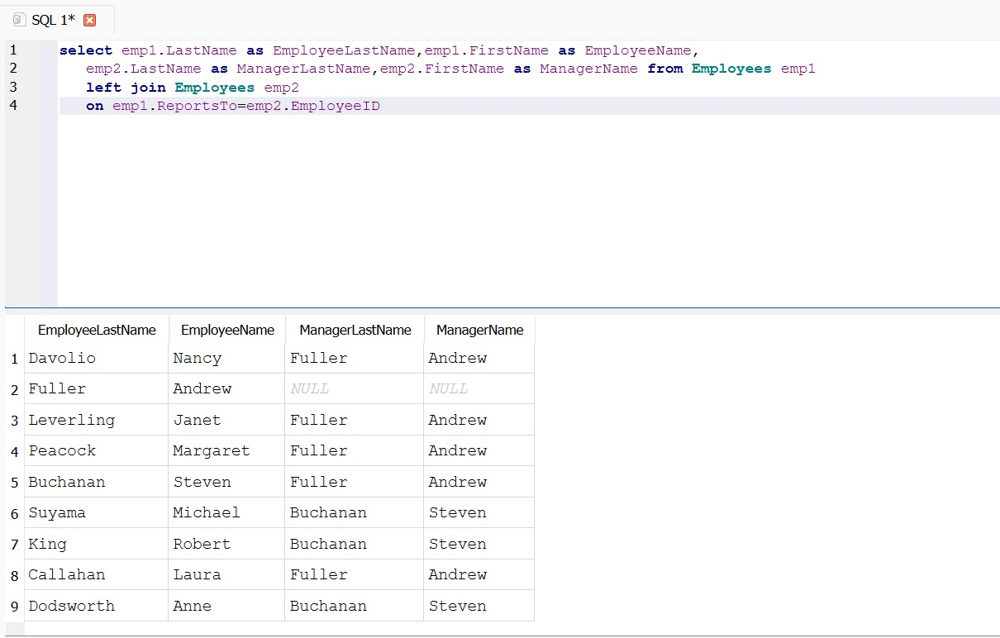

<strong>Checkpoint 3 — GROUP BY and HAVING</strong>

### Sales by category

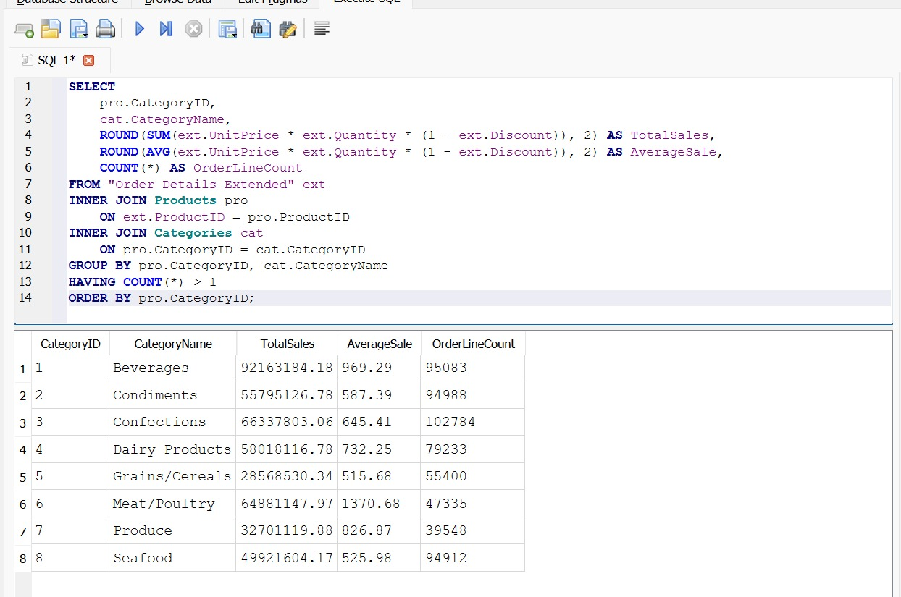

### Top five customers by sales

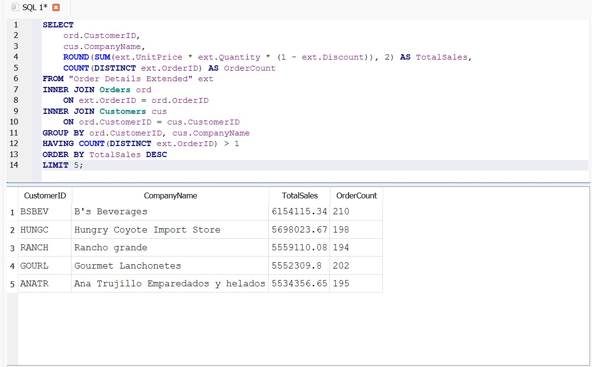

<strong>Checkpoint 4 — CTE and Subquery</strong>

### Products above the average ordered quantity

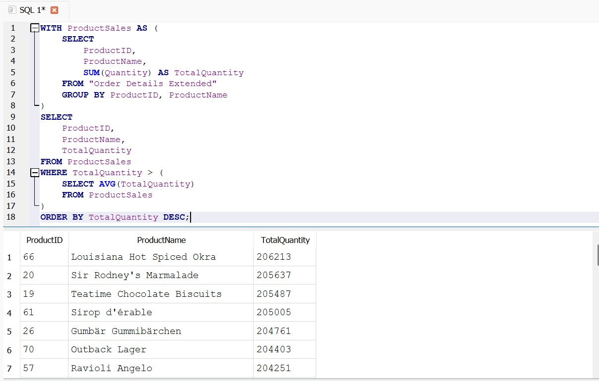

<strong>Checkpoint 5 — Window Functions</strong>

### RANK

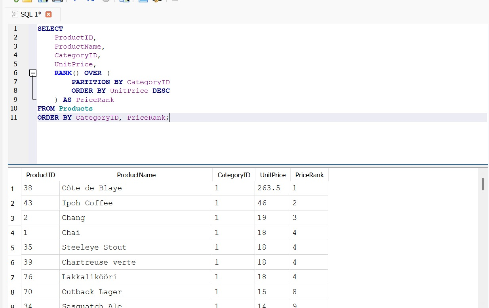

### ROW_NUMBER

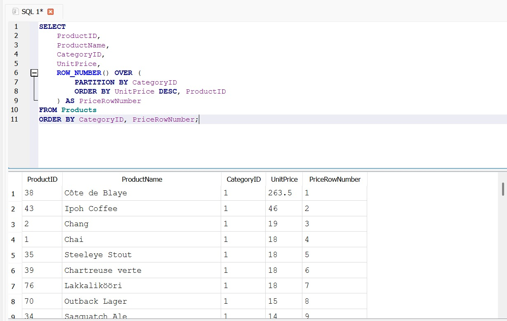

### Running stock value

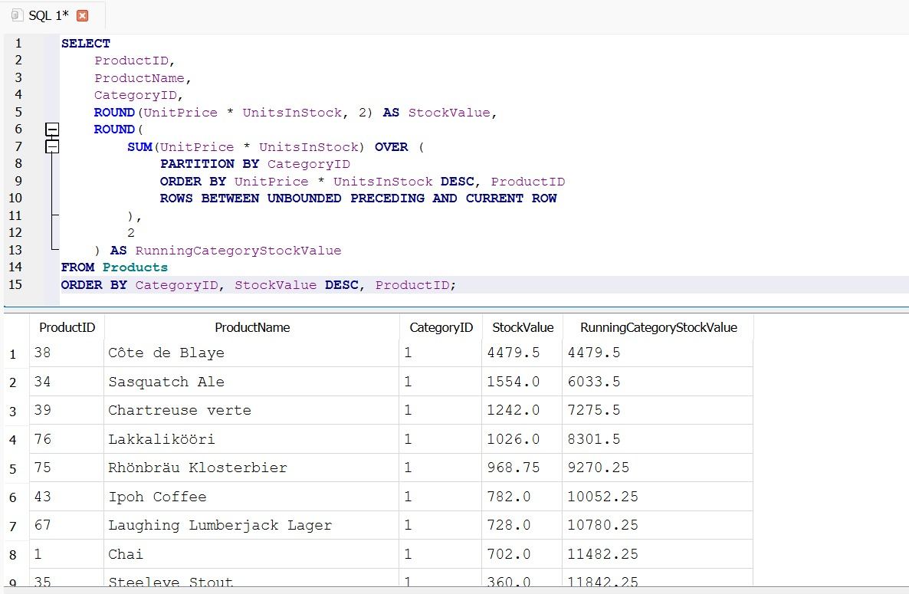

<strong>Checkpoint 6 — Query Optimization</strong>

### Query plan before index creation

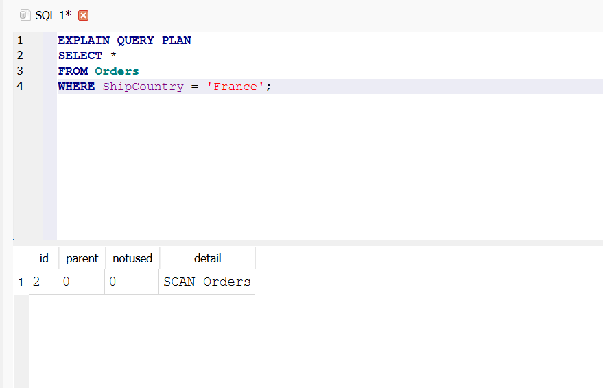

### Query plan after index creation

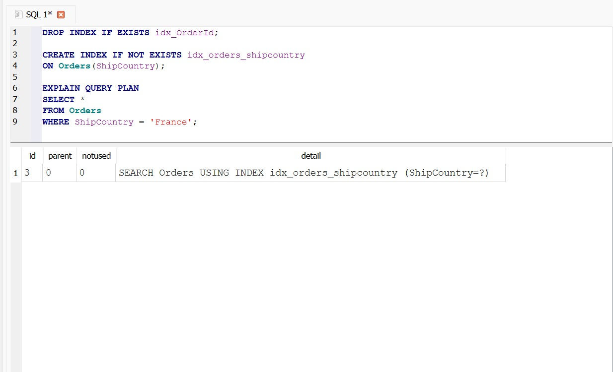

### Correlated subquery

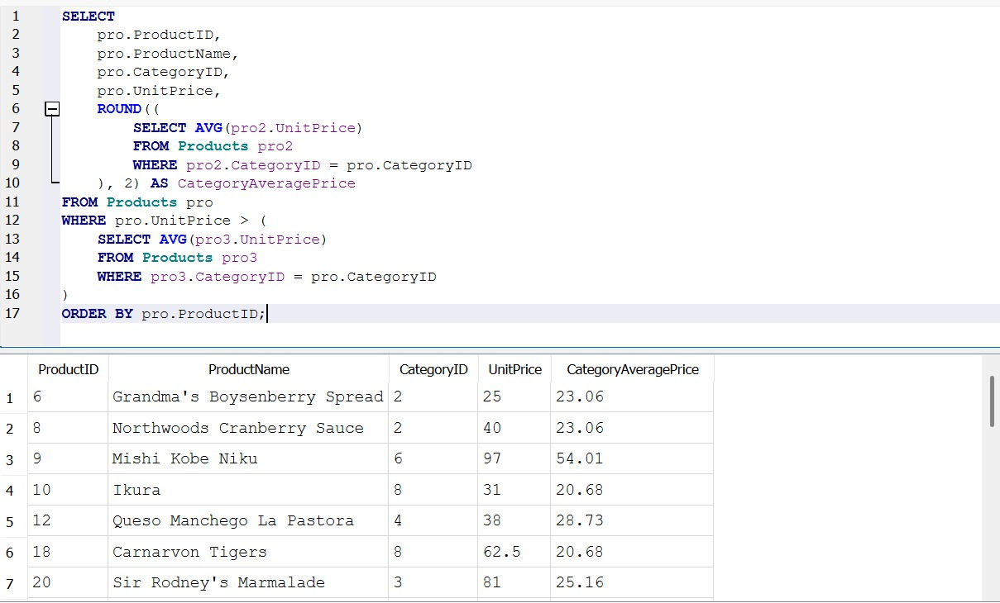

### Optimized JOIN

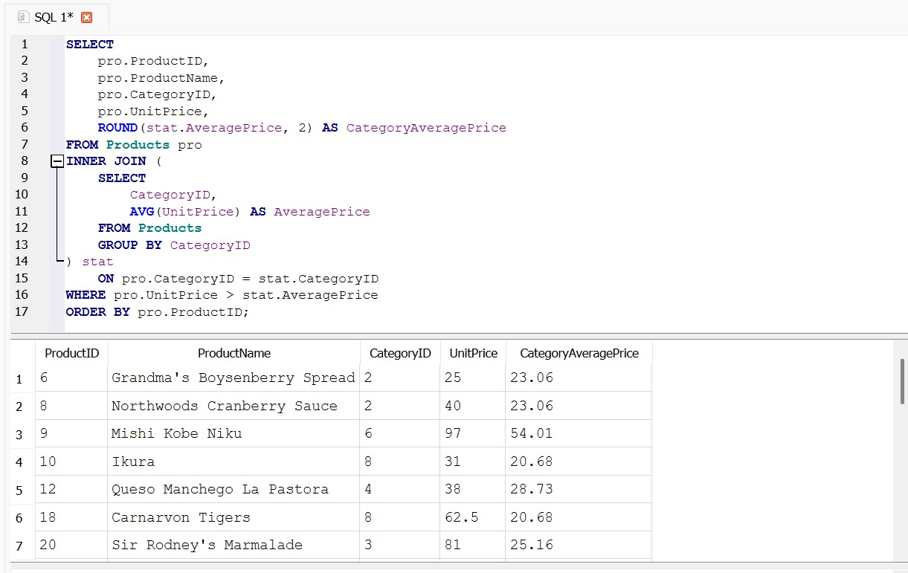

---

## Project Files

| File           | Description                                      |
| -------------- | ------------------------------------------------ |
| `README.md`    | Overview and documentation of the Week 1 project |
| `queries.sql`  | Completed SQL queries with explanations          |
| `northwind.db` | Northwind SQLite database used in the analysis   |
| `screenshots/` | Executed queries and result screenshots          |

---

## Tools Used

* SQLite
* SQL
* DB Browser for SQLite
* Northwind Database
* GitHub

---

## Status

**Week 1 has been completed and evaluated.**

The folder contains the reviewed SQL queries, supporting database, and updated result screenshots.

---

## Author

**Yalchin Hasanov**
Junior Data Analyst
