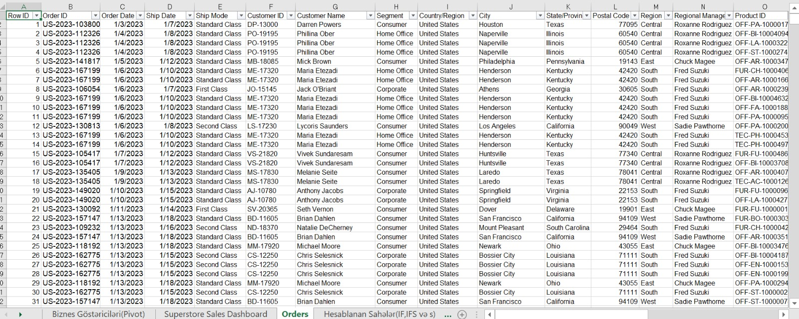
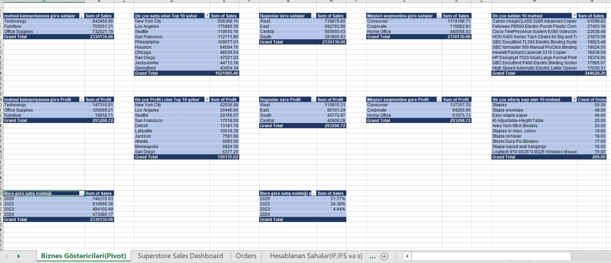
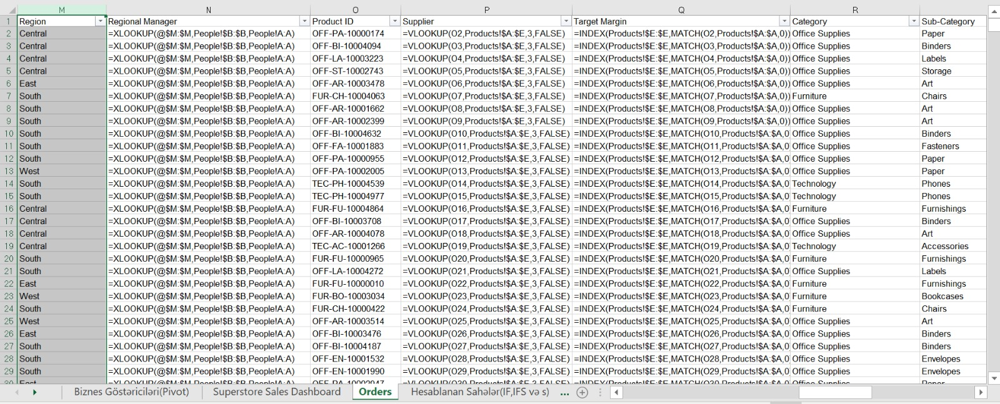
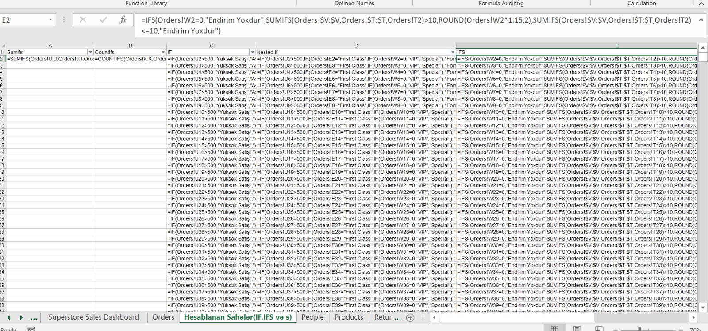
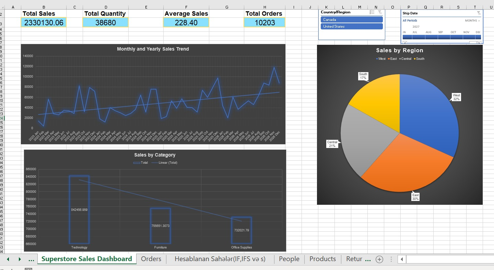
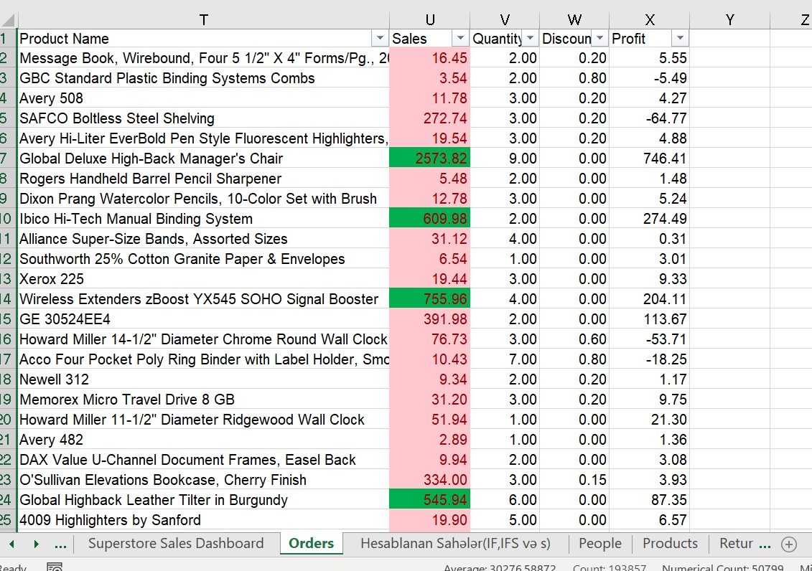

# Week 2 — Excel Data Analysis

During Week 2 of my DevJoint Data Analytics Internship, I worked with the Superstore sales dataset in Microsoft Excel.

I started by cleaning and checking the provided data. After preparing the worksheets, I used PivotTables to analyze the main business indicators, applied lookup and logical formulas, and finished the project by creating an interactive Excel dashboard.

📥 [Download the completed Excel workbook](./superstore-sales-analysis.xlsx)

---

## Checkpoint 1 — Data Cleaning and Preparation

<strong>checkpoint-01-data-cleaning</strong>

### Data Cleaning and Preparation

I started by reviewing the `Orders`, `People`, `Products`, and `Returns` worksheets.

I checked the data for blank rows, incorrect data types, repeated values, and formatting issues. For blank cells, I used `ISBLANK` and filtered the results to keep the populated records.

Some values in the `Order Date` column were stored incorrectly. I converted them using `Text to Columns` and then used `ISTEXT` to check the result. The test returned `FALSE`, confirming that the dates were no longer stored as text.

I also checked the `Target Margin` column in the `Products` worksheet with `ISNUMBER`. Since the values were initially stored as text, I converted them to numbers and applied percentage formatting.

Repeated values were also reviewed. They belonged to different orders rather than complete duplicate rows, so I kept them to avoid removing valid data.

---

## Checkpoint 2 — PivotTable Analysis

<strong>checkpoint-02-pivot-tables</strong>

### PivotTable Analysis

After cleaning the data, I created PivotTables to analyze sales, profit, order counts, and yearly performance.

### Sales Analysis

The main results I found were:

- Technology had the highest category sales: **842,456.96**
- New York City had the highest city-level sales: **256,368.16**
- West had the highest regional sales: **739,879.80**
- Consumer had the highest segment sales: **1,174,198.71**
- Canon imageCLASS 2200 Advanced Copier had the highest product sales: **61,599.82**

### Profit Analysis

I repeated the analysis using profit instead of sales:

- Technology had the highest category profit: **147,310.81**
- New York City had the highest city-level profit: **62,036.98**
- West had the highest regional profit: **110,815.31**
- Consumer had the highest segment profit: **137,357.33**

### Order and Trend Analysis

Staples had the highest order count with **60 orders**.

I also summarized sales by year from 2023 to 2026 and calculated year-over-year growth to compare sales performance between years.

---

## Checkpoint 3 — Lookup Formulas

<strong>checkpoint-03-lookup-formulas</strong>

### Lookup Formulas

In this checkpoint, I used different lookup methods to bring related information from the reference worksheets into the main `Orders` data.

I used:

- `XLOOKUP` to match each region with its Regional Manager
- `VLOOKUP` to match Product IDs with Supplier information
- `INDEX` + `MATCH` to return the Target Margin for each Product ID

After applying these formulas, the `Regional Manager`, `Supplier`, and `Target Margin` fields were available in the main dataset.

---

## Checkpoint 4 — Calculated Fields

<strong>checkpoint-04-logical-formulas</strong>

### Calculated Fields

Next, I created additional fields using aggregation and logical formulas.

I used:

- `SUMIFS` to calculate sales based on multiple conditions
- `COUNTIFS` to count records that met selected conditions
- `IF` to classify sales as `Yüksək Satış` or `Aşağı Satış`
- Nested `IF` to classify records as `VIP`, `Special`, `Formal`, or `Normal`
- `IFS` to evaluate discount and product quantity conditions
- `ROUND` to limit adjusted discount values to two decimal places

I kept these calculations in the `Hesablanan Sahələr(IF,IFS və s)` worksheet so they could be reviewed separately from the original data.

---

## Checkpoint 5 — Interactive Sales Dashboard

<strong>checkpoint-05-dashboard</strong>

### Interactive Sales Dashboard

After completing the analysis, I used the PivotTable results to build an interactive Excel dashboard.

I created four KPI cards:

- **Total Sales:** 2,330,130.06
- **Total Quantity:** 38,680
- **Average Sales:** 228.40
- **Total Orders:** 10,203

The dashboard also includes:

- Monthly and yearly sales trend
- Sales by region
- Sales by category
- Country/Region slicer
- Ship Date timeline

The slicer and timeline allow me to filter the dashboard and see how the results change for different selections.

---

## Checkpoint 6 — Conditional Formatting

<strong>checkpoint-05-conditional-formatting</strong>

### Conditional Formatting

For the final checkpoint, I applied conditional formatting to the `Sales` column.

I used two simple rules:

- Sales values above **500** are highlighted in green.
- Sales values below **500** are highlighted in light red.

This made it easier to visually separate higher and lower sales values when reviewing the data.

---

## Workbook Structure

| Worksheet | Purpose |
|---|---|
| `Orders` | Main sales dataset and lookup results |
| `People` | Regional manager information |
| `Products` | Product and target margin information |
| `Returns` | Returned order information |
| `Biznes Göstəriciləri(Pivot)` | PivotTable analysis and business summaries |
| `Hesablanan Sahələr(IF,IFS və s)` | Calculated fields and formulas |
| `Superstore Sales Dashboard` | KPI cards, charts, slicers, and timeline |

---

## Formula and PivotTable Documentation

The formulas and PivotTable settings used during the analysis are documented separately.

📖 [Open the Excel formula and PivotTable documentation](./formula-documentation.md)

---

## Project Files

- [Completed Excel Workbook](./superstore-sales-analysis.xlsx)
- [Formula and PivotTable Documentation](./formula-documentation.md)
- `screenshots/` — screenshots from the six completed checkpoints

---

**Week 2 completed.**

**Yalchin Hasanov**
