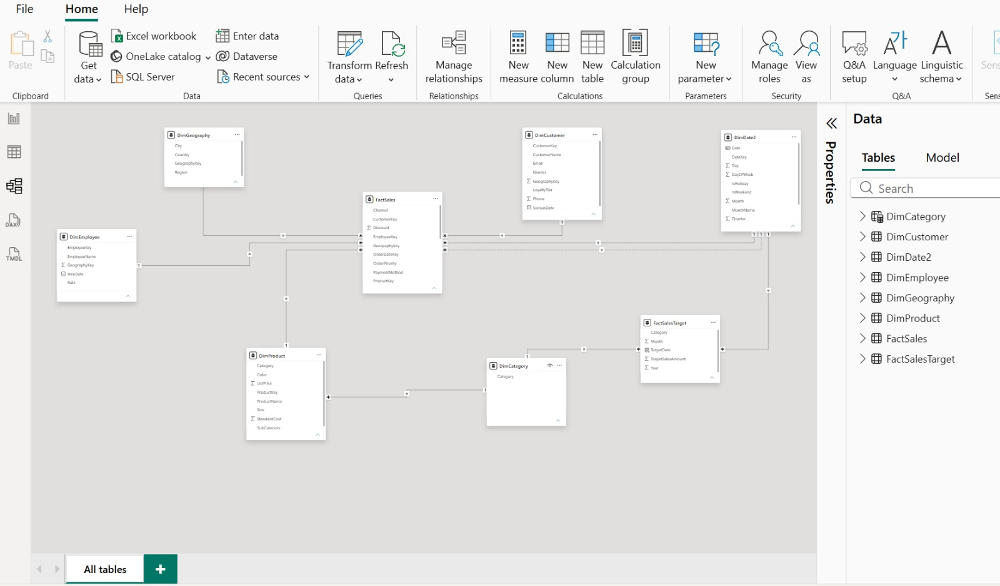
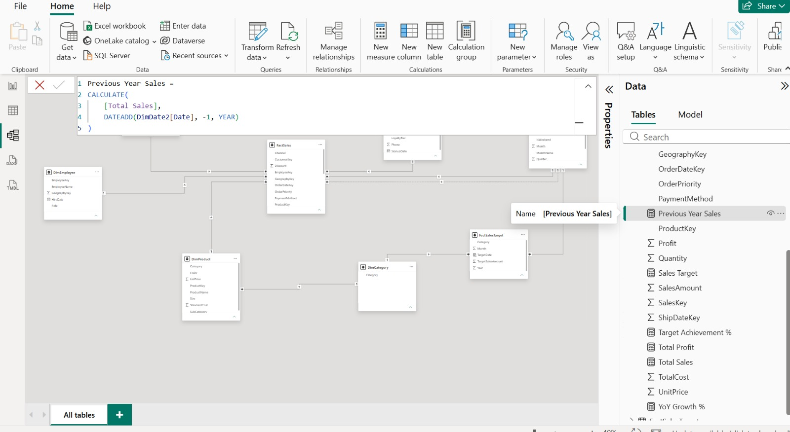
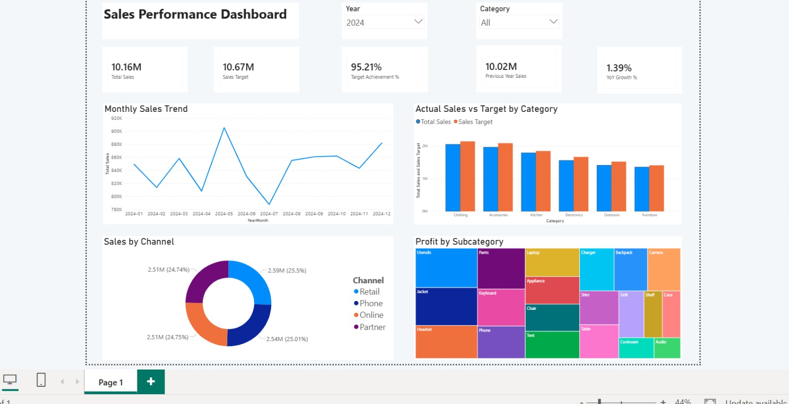
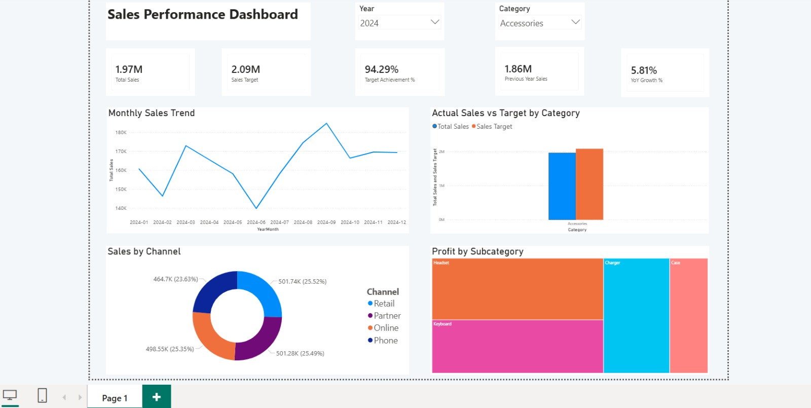

# Week 3 — Power BI Dashboard

During Week 3 of my DevJoint Data Analytics Internship, I built an interactive Sales Performance Dashboard in Power BI.

I imported seven CSV datasets covering the period from 2018 to 2024. I first prepared the data model, then created the required DAX measures and used them to build a single-page dashboard with KPIs, charts, and interactive filters.

---

## What I Worked On

During this project, I:

- Imported and checked the provided CSV datasets
- Created relationships between fact and dimension tables
- Prepared the model for Actual vs Target analysis
- Created DAX measures for sales and profit analysis
- Selected visuals based on the type of comparison
- Added Year and Category slicers
- Compared actual sales with targets and previous-year sales
- Built a single-page interactive dashboard

---

## Data Model

I used `FactSales` as the main fact table and connected it to the following dimension tables:

- `DimProduct`
- `DimCustomer`
- `DimEmployee`
- `DimGeography`
- `DimDate2`

The relationships were created as one-to-many (`1:*`) with a single filter direction from the dimension tables to `FactSales`.

`OrderDate` was used as the active date relationship. I kept `ShipDate` as an inactive relationship because the main sales analysis was based on the order date.

For the target analysis, I added `FactSalesTarget` to the model. I also created `TargetDate` and used `DimCategory` to connect actual sales and target data by category.

`DimDate2` was marked as the date table, and the `YearMonth` field was sorted chronologically.

The most important modeling step was connecting the sales and target tables correctly without creating ambiguous relationships.

---

## DAX Measures

After completing the data model, I created measures for sales, profit, target, and previous-year comparisons.

The measures used in the analysis include:

- `Total Sales`
- `Total Profit`
- `Total Quantity`
- `Sales Target`
- `Target Achievement %`
- `Sales Variance`
- `Previous Year Sales`
- `YoY Growth %`
- `Profit Margin %`

For these measures, I mainly used functions such as `SUM`, `DIVIDE`, `CALCULATE`, and `DATEADD`.

The complete formulas are available in the separate DAX documentation file.

[Open the DAX measure documentation](./dax-measures.md)

---

## Dashboard Visuals

I selected four visual types for different parts of the analysis:

- **Line Chart** — monthly sales trend
- **Clustered Column Chart** — actual sales compared with target by category
- **Donut Chart** — sales distribution by channel
- **Treemap** — profit by subcategory

I also added KPI cards to show the main results at the top of the dashboard.

---

## Interactive Filters

I added Year and Category slicers to make the dashboard interactive.

These slicers allow the user to select a specific year or product category and see the related changes in the KPI cards and dashboard visuals.

I tested the filters to make sure that the visuals responded correctly to the selected values.

---

## 2024 Results

When the dashboard is filtered for 2024, the main results are:

- **Total Sales:** 10.16M
- **Sales Target:** 10.67M
- **Target Achievement:** 95.21%
- **Previous Year Sales:** 10.02M
- **YoY Growth:** 1.39%

The results show that 2024 sales were slightly higher than the previous year, but the sales target was not fully achieved.

---

## Tools Used

- Power BI Desktop
- Power Query
- DAX
- Data Modeling

---

## Project Files

- `dax-measures.md` — DAX formulas used in the dashboard
- `screenshots/` — data model, dashboard, filter, and DAX evidence
- Power BI report file containing the completed dashboard

---

This project gave me practical experience in connecting multiple datasets, creating DAX measures, and presenting sales performance in an interactive Power BI dashboard.

**Yalchin Hasanov**
