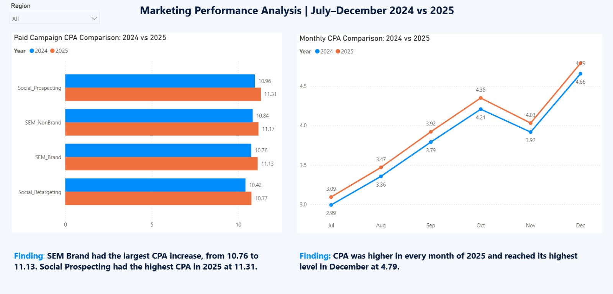

# Week 4 — Marketing Business Case Analysis

## Checkpoint 1 — Business Question and KPIs

### Business Question

How did marketing results change from July–December 2024 to the same period in 2025, and which channels or campaigns had the biggest effect on the results?

### Selected KPIs

I selected five KPIs for this analysis:

* **CPA:** Shows the average cost of one conversion.
* **ROAS:** Compares revenue with marketing spend.
* **Conversion Rate:** Shows how many sessions resulted in conversions.
* **Revenue:** Shows the income generated from marketing activities.
* **Sessions:** Shows the amount of website traffic.

I will use these KPIs to compare costs, revenue, traffic and conversions.

### Comparison Approach

I will compare the same months in 2024 and 2025. This helps me consider seasonal changes in November and December.

## Checkpoint 2 — SQL Analysis

### Data Preparation

The original file had three data sheets. I saved them as CSV files because I needed to use them as separate tables in SQLite. I formatted the date column as `yyyy-mm-dd` so I can filter and compare the data by year and month.

After the import, I checked the row counts. The `marketing_events` table has 5,888 rows, the `customers` table has 5,370 rows and the `campaigns` table has 8 rows. The original Excel file was kept unchanged.

### SQL Queries

I wrote seven SQL queries for the analysis:

1. Overall KPI results for July–December 2024.
2. Overall KPI results for July–December 2025.
3. Channel results for July–December 2024.
4. Channel results for July–December 2025.
5. Results grouped by channel and region for 2025.
6. Results grouped by campaign for 2025.
7. Results grouped by campaign for 2024.

The queries use `SUM`, `ROUND`, `WHERE`, `BETWEEN`, `GROUP BY`, `ORDER BY` and a simple `JOIN`.

[View the SQL analysis](./week4_marketing_analysis.sql)

## Checkpoint 3 — Root Cause Analysis

### Overall Result

I compared the overall results for 2024 and 2025. Sessions stayed almost the same, while revenue increased from 5.93 million to 6.60 million. ROAS increased from 13.90 to 14.39 and Conversion Rate increased from 5.71% to 5.95%.

The main negative change was CPA. It increased from 3.86 to 3.98, which means the average cost of a conversion became slightly higher.

### Channel and Campaign Findings

CPA increased in all channels. The largest channel-level increase was in Paid Search, where CPA increased from 10.80 to 11.15. Paid Social CPA also increased from 10.69 to 11.04. Paid Social had the lowest ROAS at 4.27 and the lowest Conversion Rate at 3.18% in 2025.

At campaign level, SEM_Brand had the largest CPA increase, from 10.76 to 11.13. Social_Prospecting had the weakest results in 2025, with a CPA of 11.31, a ROAS of 4.18 and a Conversion Rate of 3.10%.

The comparison shows that Paid Search had the largest CPA increase, while Paid Social and Social_Prospecting had the weakest efficiency results.

## Checkpoint 4 — Narrative Visualization

I created a Power BI page with two charts to show the CPA change.

The monthly line chart compares CPA from July to December in 2024 and 2025. CPA was higher in every month of 2025 and reached its highest level in December at 4.79.

The campaign chart compares the four paid campaigns. SEM Brand had the largest CPA increase, from 10.76 to 11.13. Social Prospecting had the highest CPA in 2025 at 11.31.

I used blue for 2024 and orange for 2025. I also added a Region slicer to check the results for different regions.

### Power BI Visualization

[View or download the Power BI file](week4_marketing_visualization.pbix)

